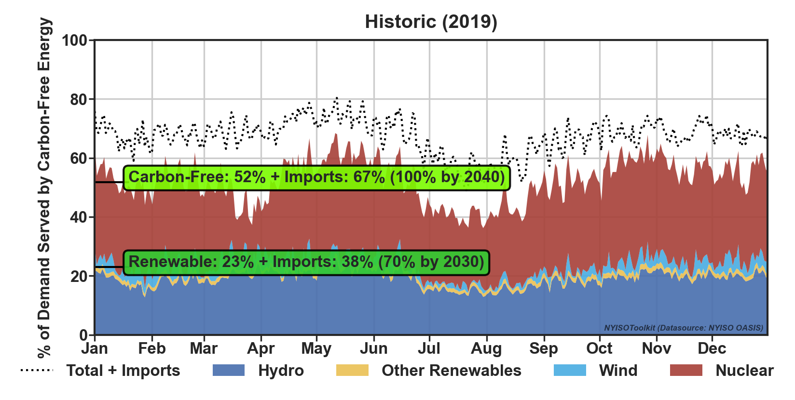

# NYISOToolkit
A package for accessing power system data data (NYISOData), generating statistics (NYISOStat), and creating visualizations (NYISOVis) from the New York Independent System Operator (NYISO). 

# Installation
```python
pip install git+https://github.com/m4rz910/NYISOToolkit#egg=nyisotoolkit
```

## NYISOVis
There are three kinds of visualizations currently supported, check them all out in the visualizations folder. The visualizations are focused on communicating New York's status toward achieving the decarbonization goals outlined by the Climate Leadership and Community Protection Act (CLCPA). 

"No later than [June 13, 2021], the commission shall establish a program to require that:
* (A) A minimum of [70%] of the state wide electric generation secured by jurisdictional load serving entities to meet the electrical energy requirements of all end-use customers in New York State in [2030] shall  be generated by  renewable  energy  systems;
* (B) and that by [2040] the  statewide  electrical demand system will be zero emissions."
       - Source: [CLCPA p.17](https://www.nysenate.gov/legislation/bills/2019/s6599)

### Usage Example
```python
from nyisotoolkit import NYISOData, NYISOStat, NYISOVis
NYISOVis.fig_clcpa_carbon_free(year='2019', f='D')  # daily (D) or monthy (M) frequency is recommended
#figures saved in visualization folder by default

```

 
## NYISOData
Raw Data Source: http://mis.nyiso.com/public/

Datasets Currently Supported:
- load_h  (hourly load by NYISO region)
- load_5m (5-min load by NYISO region)
- load_forecast_h (hourly load forecast by NYISO region)
- fuel_mix_5m (5-min frequency)
- interface_flows_5m (5-min internal and external flows between regions)
- lbmp_dam_h (hourly day-ahead zonal location based marginal price)
- lbmp_rt_5m (5-min reak time zonal location based marginal price)

All datasets:
- Timezone: Coordinated Universal Time [UTC]
- Frequency: Hourly or 5-mins. The raw data sometimes has higher or lower frequency than intended, but this library uses mean values to resample at the intended frequency. When interpolations are necessary, they are made. Some datasets only come in one frequency.
- Datetime Convention: Start. The value(s)/measurement(s) associated with each timestamp occurred in the time period before the start of the next timestamp.

### Usage Example
```python
from nyisotoolkit import NYISOData, NYISOStat, NYISOVis
df = NYISOData(dataset='load_h', year='2019').df # year argument in local time, but returns dataset in UTC 

#If you need to work with data in local time, then convert time zone
df = df.tz_localize('US/Eastern')

#Construct datasets for certain years
years = ['2013','2019','2020']
datasets = ['load_h','interface_flows_5m']
NYISOData.construct_databases(years=years, datasets=datasets, redownload=True, reconstruct=True, create_csvs=False)
```

### Dataset Information

Load (load_h)
- "Integrated Real-Time Actual Load is posted after each hour and represents the timeweighted hourly load for each zone" (NYISO Market Participant Guide p.62)
- Units: Power [MW]
- Frequency: Hour

Load (load_5m)
- "Real-Time Actual Load posts the actual measured load for each RTD interval (5 minutes) by zone. 
Actual loads are calculated as generation plus net interchange for each zone, based on real-time telemetered data." (NYISO Market Participant Guide p.62)
- Units: Power [MW]
- Frequency: 5-min

Load Forecast (load_forecast_h)
- "Weather forecast information grouped by zone is input into a neural network forecaster tool to produce a preliminary zonal load forecast for each hour of the following day. The tool makes use of historical load and weather patterns." (NYISO Market Participant Guide p.25)
- Units: Power [MW]
- Frequency: Hour

Fuel Mix (fuel_mix_5m)
- Units: Power [MW]
- Frequency: 5-min

Interface Flows (interface_flows_5m)
- "Internal/ External Interface Limits and Flows consist of hourly limits (for all major internal interfaces, HQ, NE, PJM, and OH) and flows (for HQ, NE, PJM, and OH) in SCUC and time-weighted average hourly flows (for the same interfaces) in RTD. The data is posted at least day-after or sooner." (NYISO Market Participant Guide p.59)
- Units: Power [MW] (Note: The raw datafile column is mislabled as MWH, but it is correct on the NYISO Dashboard)
- Frequency: 5-min

    External Interfaces
    - HQ CHATEAUGUAY
    - HQ CEDARS
    - HQ Import Export (subset of HQ CHATEAUGUAY)
    - NPX NEW ENGLAND (NE)
    - NPX 1385 NORTHPORT (NNC)
    - NPX CROSS SOUND CABLE (CSC)
    - IESO
    - PJM KEYSTONE
    - PJM HUDSON TP
    - PJM NEPTUNE
    - PJM LINDEN VFT

    Internal Interfaces
    - CENTRAL EAST - VC
    - DYSINGER EAST
    - MOSES SOUTH
    - SPR/DUN-SOUTH
    - TOTAL EAST
    - UPNY CONED
    - WEST CENTRAL

```python
#The following map is used to map datafile external interface names and those on the website
external_tflows_map = {'SCH - HQ - NY': 'HQ CHATEAUGUAY',
                       'SCH - HQ_CEDARS': 'HQ CEDARS',
                       'SCH - HQ_IMPORT_EXPORT': 'SCH - HQ_IMPORT_EXPORT', #subset of HQ Chateauguay…it includes only scheduled import/export flows over Chateauguay, and excludes wheel-through interchange
                       'SCH - NE - NY':  'NPX NEW ENGLAND (NE)',
                       'SCH - NPX_1385': 'NPX 1385 NORTHPORT (NNC)',
                       'SCH - NPX_CSC':  'NPX CROSS SOUND CABLE (CSC)',
                       'SCH - OH - NY':  'IESO',
                       'SCH - PJ - NY':  'PJM KEYSTONE',
                       'SCH - PJM_HTP':  'PJM HUDSON TP',
                       'SCH - PJM_NEPTUNE':'PJM NEPTUNE',
                       'SCH - PJM_VFT': 'PJM LINDEN VFT'}     
```
LBMP (lbmp_dam_h)
- NYISO Market Participant Guide
- Units: Price [$/MWh]
- Frequency: Hour

LBMP (lbmp_rt_5m)
- NYISO Market Participant Guide
- Units: Price [$/MWh]
- Frequency: Hour
