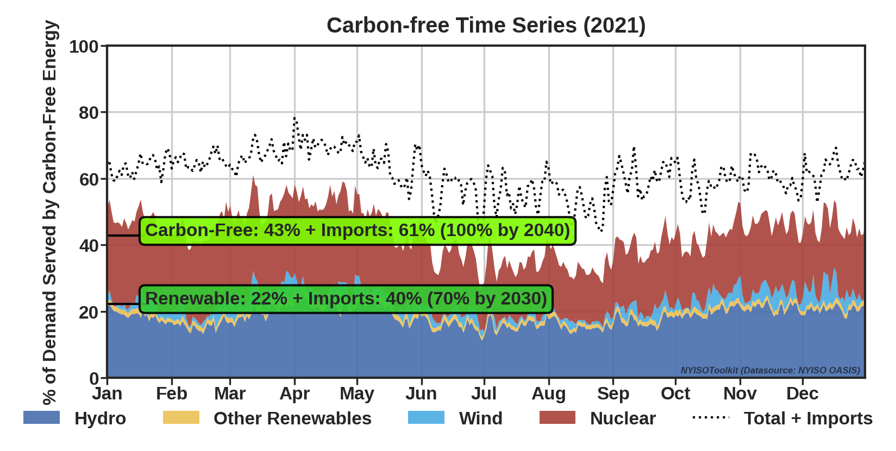

## NYISOToolkit

A package for accessing power system data (`NYISOData`), generating statistics (`NYISOStat`), and creating visualizations (`NYISOVis`) from the [New York Independent System Operator (NYISO)](https://www.nyiso.com/).

Check out the [NYISOToolkit Web App!](http://viosimos.com/nyisotoolkit/)

## How to Install

```python
pip install git+https://github.com/m4rz910/NYISOToolkit#egg=nyisotoolkit
```
 
## NYISOData

**Example:**
```python
from nyisotoolkit import NYISOData, NYISOStat, NYISOVis
df = NYISOData(dataset='load_h', year='2019').df # year argument in local time, but returns dataset in UTC

#If you need to work with data in local time, then convert time zone
df = df.tz_convert('US/Eastern')

#Construct datasets for certain years
years = ['2013','2019','2020']
datasets = ['load_h','interface_flows_5m']
NYISOData.construct_databases(years=years, datasets=datasets, redownload=True, reconstruct=True, create_csvs=False)
```

Raw Data Source: http://mis.nyiso.com/public/

Dataset Name | Resolution | Description
--- | --- | --
`load_h` | hourly | day-ahead load by NYISO region
`load_5m` | 5-min | real-time load by NYISO region
`load_forecast_h` | hourly | load forecast by NYISO region
`fuel_mix_5m` | 5-min | real-time aggregated fuel mix data
`interface_flows_5m` | 5-min | real-time flows between regions
`lbmp_dam_h` | hourly | day-ahead zonal Locational Based Marginal Price (LBMP)
`lbmp_rt_5m` | 5-min | real-time zonal LBMP
`lbmp_dam_h_refbus` | hourly | day-ahead reference bus marginal cost of energy
`lbmp_rt_h_refbus` | hourly | time weighted average rt reference bus marginal cost of energy
`asp_rt` | 5-min | real-time zonal ancillary service prices
`asp_dam` | hourly | day-ahead zonal ancillary service prices

All datasets:

* Timezone: Coordinated Universal Time [UTC]
* Frequency: Hourly or 5-mins. The raw data sometimes has higher or lower frequency than intended, but this library uses mean values to resample at the intended frequency. When interpolations are necessary, they are made. Some datasets only come in one frequency.
* Datetime Convention: Start. The value(s)/measurement(s) associated with each timestamp occurred in the time period before the start of the next timestamp.

### More Dataset Information

#### Load (`load_h`)

* "Integrated Real-Time Actual Load is posted after each hour and represents the timeweighted hourly load for each zone" (NYISO Market Participant Guide p.62)
* Units: Power [MW]
* Frequency: Hour

#### Load (`load_5m`)

* "Real-Time Actual Load posts the actual measured load for each RTD interval (5 minutes) by zone.
Actual loads are calculated as generation plus net interchange for each zone, based on real-time telemetered data." (NYISO Market Participant Guide p.62)
* Units: Power [MW]
* Frequency: 5-min

#### Load Forecast (`load_forecast_h`)

* "Weather forecast information grouped by zone is input into a neural network forecaster tool to produce a preliminary zonal load forecast for each hour of the following day. The tool makes use of historical load and weather patterns." (NYISO Market Participant Guide p.25)
* Units: Power [MW]
* Frequency: Hour

#### Fuel Mix (`fuel_mix_5m`)

* Units: Power [MW]
* Frequency: 5-min

#### Interface Flows (`interface_flows_5m`)

* "Internal/ External Interface Limits and Flows consist of hourly limits (for all major internal interfaces, HQ, NE, PJM, and OH) and flows (for HQ, NE, PJM, and OH) in SCUC and time-weighted average hourly flows (for the same interfaces) in RTD. The data is posted at least day-after or sooner." (NYISO Market Participant Guide p.59)
* Units: Power [MW] (Note: The raw datafile column is mislabled as MWH, but it is correct on the NYISO Dashboard)
* Frequency: 5-min

Interface Name | Type | Mapping Name | Notes
--- | --- | --- | ---
CENTRAL EAST | Internal | `CENTRAL EAST - VC`
DYSINGER EAST | Internal | `DYSINGER EAST`
MOSES SOUTH | Internal | `MOSES SOUTH`
SPR/DUN-SOUTH | Internal | `SPR/DUN-SOUTH`
TOTAL EAST | Internal | `TOTAL EAST`
UPNY CONED | Internal | `UPNY CONED`
WEST CENTRAL | Internal | `WEST CENTRAL`
HQ CHATEAUGUAY | External | `SCH - HQ - NY`
HQ CEDARS | External | `SCH - HQ_CEDARS`
HQ Import Export | External | `SCH - HQ_IMPORT_EXPORT` | subset of HQ CHATEAUGUAY, excludes wheel-through
NPX NEW ENGLAND (NE) | External | `SCH - NE - NY`
NPX 1385 NORTHPORT (NNC) | External | `SCH - NPX_1385`
NPX CROSS SOUND CABLE (CSC) | External | `SCH - NPX_CSC`
IESO | External | `SCH - OH - NY`
PJM KEYSTONE | External | `SCH - PJ - NY`
PJM HUDSON TP | External | `SCH - PJM_HTP`
PJM NEPTUNE | External | `SCH - PJM_NEPTUNE`
PJM LINDEN VFT | External | `SCH - PJM_VFT`

#### LBMP (`lbmp_dam_h`)

* NYISO Market Participant Guide
* Units: Price [$/MWh]
* Frequency: Hour

#### LBMP (`lbmp_rt_5m`)

* NYISO Market Participant Guide
* Units: Price [$/MWh]
* Frequency: Hour

#### Ancillary Service Price (`asp_rt`)

* Units: Price [$/MWh]
* Frequency: Hour

#### Ancillary Service Price (`asp_dam`)

* Units: Price [$/MWh]
* Frequency: 5-min

## NYISOVis
There are several visualizations currently supported - browse them on the [NYISOToolkit Web App](http://viosimos.com/nyisotoolkit/) or in the nyisotoolkit/nyisovis/visualizations folder. The visualizations are focused on communicating New York's status toward achieving the power sector decarbonization goals outlined by the Climate Leadership and Community Protection Act (CLCPA). 

> No later than [June 13, 2021], the commission shall establish a program to require that:
>
> * (A) A minimum of [70%] of the state wide electric generation secured by jurisdictional load serving entities to meet the electrical energy requirements of all end-use customers in New York State in [2030] shall  be generated by  renewable  energy  systems;
> * (B) and that by [2040] the  statewide  electrical demand system will be zero emissions."

**Source:** [CLCPA p.17](https://www.nysenate.gov/legislation/bills/2019/s6599)

**Example:**

```python
from nyisotoolkit import NYISOData, NYISOStat, NYISOVis
nv = NYISOVis(year='2019') #figures saved in nyisotoolkit/nyisovis/visualization folder by default.  
nv.fig_carbon_free_timeseries(f='D')  # daily (D) or monthy (M) frequency is recommended
print(f"Figures saved by default to: {nv.out_dir} \nYou can change this by passing a pathlib object to the out_dir parameter in the NYISOVis object initialization.")
```

